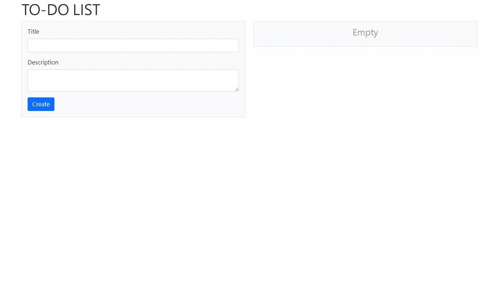
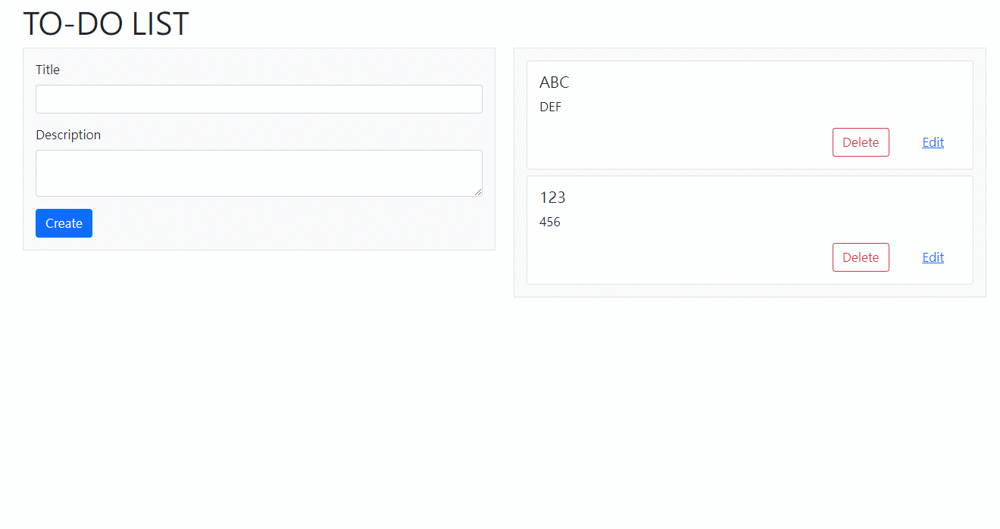
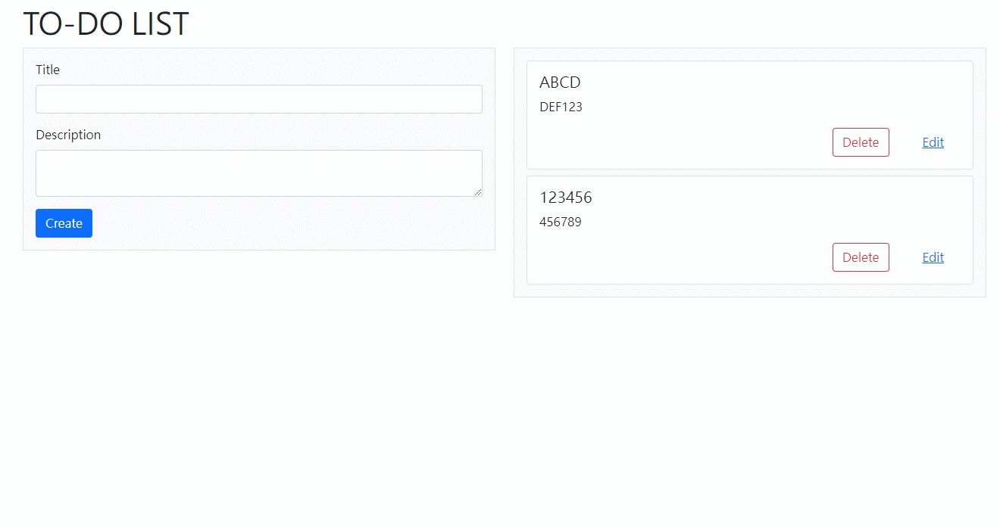

# A simple to-do list based on Vue.js and Vite

## Run with dev server
1. Clone this repository
2. `npm install`
3. `npm run dev`

## Demo

### Create action items

### Update action items

### Delete action items

## Recommended IDE Setup

- [VSCode](https://code.visualstudio.com/) + [Volar](https://marketplace.visualstudio.com/items?itemName=johnsoncodehk.volar)
